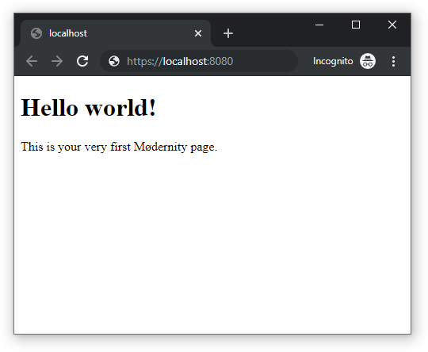
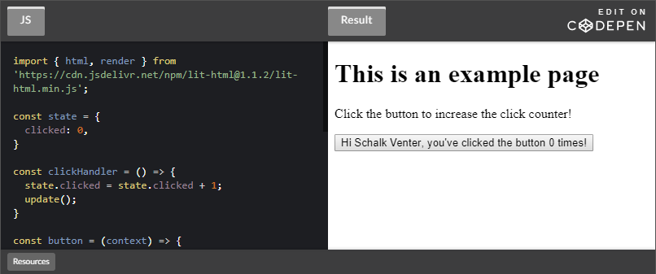

**Mødernity is an 11ty-based starter built specifically for remote, open-source and volunteer-driven web projects.**

It is a good fit for teams or individuals that require the following:

- The benefits of a modern [JAMstack](https://jamstack.org/) website.
- Contributions from developers across the entire skill spectrum.

Mødernity is made up of beginner-friendly tooling that automatically enforce best practices and have ready-to-go documentation. The primary goal is to make it effortless for  contributors to write, read and test code. In addition, pre-configured linting and testing tools makes it easier for you to maintain/merge external changes with confidence.

**Mødernity isn't a library or framework. It is a pre-configured bundle of modern, yet beginner-friendly front-end tooling. This means that what you see is what you get. There are no Mødernity config files nor any Mødernity-specific abstractions in this codebase.**

**Table of Contents:**

- [Installation](#installation)
  - [Environment](#environment)
  - [Installation](#installation-1)
- [Getting started](#getting-started)
  - [Create your first page](#create-your-first-page)
  - [Creating a shared component](#creating-a-shared-component)
  - [Making your component dynamic](#making-your-component-dynamic)
  - [Nesting components](#nesting-components)
  - [Updating pages in real-time](#updating-pages-in-real-time)
  - [Auto-triggering page updates](#auto-triggering-page-updates)
- [Managing contributions](#managing-contributions)
- [Customizing Mødernity](#customizing-m%c3%b8dernity)
- [Tech-stack](#tech-stack)
  - [Core](#core)
    - [11ty](#11ty)
    - [lit-html](#lit-html)
  - [Testing / Linting](#testing--linting)
    - [Storybook](#storybook)
    - [Prettier](#prettier)
    - [Stylelint](#stylelint)
    - [ESLint](#eslint)
    - [Husky](#husky)
- [Future Roadmap](#future-roadmap)

# Installation

## Environment

**Make sure you have the latest versions of both [NodeJS](https://nodejs.org/en/) and [Git](https://git-scm.com/) installed. In addition, for real-time linting and syntax-higlighting make sure to add the following to your IDE:**

   - [Adding ESLint](https://eslint.org/docs/user-guide/integrations)
   - [Adding Stylelint](https://stylelint.io/user-guide/complementary-tools#editor-plugins)
   - [Adding lit-html syntax higlighting](https://lit-html.polymer-project.org/guide/tools#ide-plugins)

## Installation

**Open either the [Unix Shell](https://en.wikipedia.org/wiki/Unix_shell) (OSX or Linux), [Powershell](https://en.wikipedia.org/wiki/PowerShell) (Windows) or your custom terminal complete the following:**

1. Navigate to the location where you want to place your project folder.

2. Clone the repository via `git clone https://github.com/schalkventer/modernity.git`

3. Install all dependencies via `npm install`.

4. Replace delete `README.md` and rename `README.md.prod`. to `README.md`

5. Run the following commands as needed:
   1. To build the website into the `dist` folder run: `npm run build`.
   2. To start a local development server at [http://localhost:8080/](http://localhost:8080/) run: `npm start`.
   3. To start the Storybook component-testing framework run: `npm test`.
   4. To check and auto-fix code against defined conventions run: `npm run lint`.

# Getting started

## Create your first page

Mødernity is built on [11ty](https://www.11ty.io/) and uses [lit-html](https://lit-html.polymer-project.org/) for both client-side and static-html templating.

*html-lit*, initially created by the Google-backed team working on [Polymer](https://polymer-project.org/), was chosen because it is very easy to learn, while still being extremely expressive. It is currently one of the few well-known templating langauge that relies exclusively on plain JavaScript without any abstractions.

Since our instance of 11ty is set to build our pages from the `src/pages` directory and we can create a homepage file at `src/page/index.11ty.js`.

In this file we can add the following:

```js
/* src/pages/index.11ty.js */

import { html } from 'lit-html';
import createPage from '../helpers/createPage';

const page = html`
  <html>
  <head>
    <title>Our home page</title>
  </head>
     <body>
      <h1>Hello world!</h1>
      <p>This is your very first Mødernity page.</p>
     </body>
  </html>
`;

export default createPage(page);
```

That's it! We should see the following if we run `yarn start` and navigate to `https://localhost:8080:`



You can add additional pages by using the same 11ty convention for generating pages. For example:
- `src/pages/index.11ty.js` creates `www.example.com`.
- `src/pages/about/index.11ty.js` creates `www.example.com/about`.
- `src/pages/product/potato-cat/index.11ty.js` creates `www.example.com/product/potato-cat`

## Creating a shared component

However, after you've added several pages you start to notice that it becomes quite cumbersome to add all the surrounding HTML tags everytime (especially as our site grows). 

Luckily this can be solved by wrapping these tags in a shareable component. Let us create a component named 'wrapper.js' (note that we only need to add `11ty.js` for files that create website pages). You will notice that all a component is, is a run-of-the-mill JavaScript function that return HTML based on the context and children passed to it.

```js
/* src/components/wrapper/index.js */

import { html } from 'lit-html';

export default (context, children) => html`
  <html>
    <head>
      <title>${context.title}</title>
    </head>
    <body>
      ${children}
    </body>
  </html>
`;
```

We can then change our homepage as follows:

```js
/* src/pages/index.11ty.js */

import { html } from 'lit-html';
import createPage from '../helpers/createPage';
import wrapper from '../components/wrapper';

const content = html`
  <h1>Hello world!</h1>
  <p>This is your very first Mødernity page.</p>
`;

const page = html`
  ${wrapper({ title: 'Homepage' }, content)}
`;

export default createPage(page)
```

## Making your component dynamic

We can even set a component's styling by importing a CSS file and using a helper function included in the Mødernity itself. Also notice the `@click=${}` *lit-html*-specific value below. 

```css
/* src/components/button/styles.css */

.button {
  display: inline-block;
  background: #e0e0e0;
  color: rgba(0, 0, 0, 0.87);
  padding: 4px 8px;
  box-shadow: 
    0px 3px 1px -2px rgba(0,0,0,0.2), 
    0px 2px 2px 0px rgba(0,0,0,0.14), 
    0px 1px 5px 0px rgba(0,0,0,0.12);
}

.button.blue {
  background: #1976d2;
  color: white;
}

```

```js
/* src/components/button/index.js */

import { html } from 'lit-html';
import calcStyling from '../../helpers/calcStyling';
import './styles.css';

// `calcStyling` adds a CSS class name if it's condition is true.
const cssClasses = calcStyling({
  'button': true,
  'blue': context.primary === true,
})

// `<button>` will have the following classes: "button blue"
export default (context, content) => html`
  <button 
    class="${cssFromContext(context)}
    @click=${context.handleClick}
  >
    Click me!
  </button>
`;
```

## Nesting components

Components can also be nested inside other components:

```js
// src/pages/index.11ty.js

import { html } from 'lit-html';
import wrapper from '../components/wrapper';
import button from '../components/button';

const handleClick = () => alert('Button was clicked!');

const content = html`
  <h1>Hello world!</h1>
  <p>This is your very first Mødernity page.</p>
  ${button({ primary: true, handleClick })}
`;

export default html`
  ${wrapper({ title: 'Homepage' }, content)}
`;
```

## Updating pages in real-time

Now for the part where *lit-html* really shines! We can effortlessly change the template real-time on the client-side. This is where *lit-html* really shines over other beginner-friendly templating languages! We can use the included `updatePage` helper function to make real-time updates to a page as follows.

*Note that dynamic values should only be stored in page level `.11ty.js` files and not in components.*

```js
// src/pages/index.11ty.js

import { html, render } from 'lit-html';
import updatePage from '../helpers/updatePage';
import createPage from '../helpers/createPage';
import wrapper from '../components/wrapper';
import button from '../components/button';

let primary = true;

const handleClick = () => {
  primary = !primary;
  updatePage();
}

const content = html`
  <h1>Hello world!</h1>
  <p>This is your very first Mødernity page.</p>
  ${button({ primary })}
`;

const page = html`
  ${wrapper({ title: 'Homepage' }, content)}
`;

export default createPage(page);
```

## Auto-triggering page updates

Lastly, if we want to update a value once the JavaScript loads we can do this following with the `checkIfPageLoaded` helper function. This is useful if you want to load data from a remote endpoint, the localStorage API or even if you want to add dynamic data (for example the current date) once the page is loaded.

In the following example we are saving the state of the button in the localStorage browser API and only showing the button once we checked the localStorage value:

```js
// src/pages/index.11ty.js

import { html, render } from 'lit-html';
import updatePage from '../helpers/updatePage';
import createPage from '../helpers/createPage';
import checkIfPageLoaded from '../helpers/checkIfPageLoaded';
import condition from '../helpers/condition';
import wrapper from '../components/wrapper';
import button from '../components/button';

let primary = undefined;

if (checkIfPageLoaded()) {
  primary = localStorage.get('primary') === 'true';
}

const handleClick = () => {
  localStorage.set('primary', !primary)
  primary = !primary;
  updatePage();
}

const content = html`
  <h1>Hello world!</h1>
  <p>This is your very first Mødernity page.</p>
  ${primary !== undefined ? button({ primary }) : ''}
`;

const page = html`
  ${wrapper({ title: 'Homepage' }, content)}
`;

export default createPage(page);
```

# Managing contributions

...

# Customizing Mødernity

**Mødernity is guided by three core principles:**

1. ***Readability***: Developers should be able to automatically enforce project-defined conventions at all times.
2. ***Accesibility***: Developers should require only limited HTML, CSS and JavaScript experience to contribute.
3. ***Transparency:*** Should use modern, well-documented third-party tooling instead of bespoke opaque abstractions.

# Tech-stack

## Core

### 11ty

[11ty](https://www.11ty.dev/) conventions pending....

### lit-html

**[lit-html](https://lit-html.polymer-project.org/) is tiny library that allows developers to write both client-side and static-html by using regular JavaScript syntax.**

[](https://codepen.io/schalkventer/pen/BayoJPa)

## Testing / Linting

### Storybook

### Prettier

[Prettier](https://prettier.io/) conventions pending....

### Stylelint

All Sass files are linted via [Stylelint](https://stylelint.io/) with the following plugins:

- [Stylelint SCSS](stylelint-scss)
- [Stylelint Selector BEM Pattern](https://github.com/simonsmith/stylelint-selector-bem-pattern)

[BEM CSS methodology](https://en.bem.info/) is enforced to keep styling consistent with the underlying [Material Design Components](https://material.io/develop/web/) styling. If you are not familiar with BEM please consult the [The BEM quickstart documentation](https://en.bem.info/methodology/quick-start/).

### ESLint

All Sass files are linted via [ESLint](https://eslint.org/) with the following plugins:

- [Stylelint SCSS](stylelint-scss)
- [Stylelint Selector BEM Pattern](https://github.com/simonsmith/stylelint-selector-bem-pattern)

[BEM CSS methodology](https://en.bem.info/) is enforced to keep styling consistent with the underlying [Material Design Components](https://material.io/develop/web/) styling. If you are not familiar with BEM please consult the [The BEM quickstart documentation](https://en.bem.info/methodology/quick-start/).

### Husky

[Husky](https://github.com/typicode/husky) conventions pending...

# Future Roadmap

- [ ] Add ability to install starter with NPX.
- [ ] Add built-in support for native web-components.
- [ ] Adds progressively enhanced SPA-like behaviour (similar to Gatsby/Gridsome).
- [ ] Add built-in basic service worker.